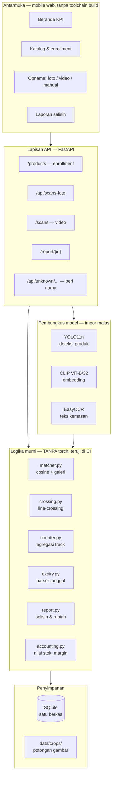
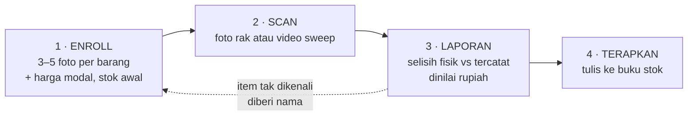
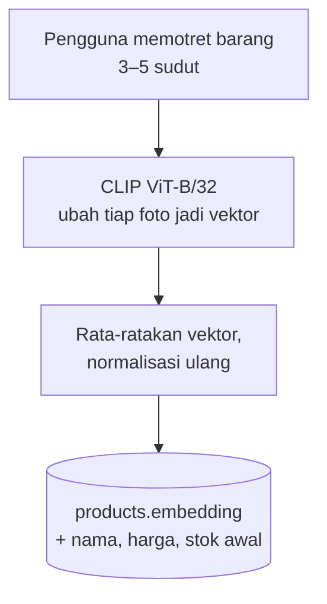
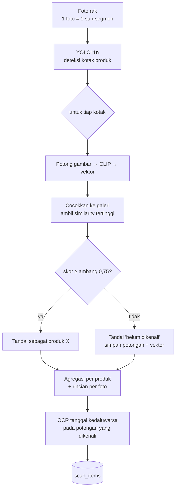
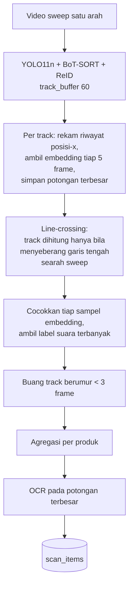
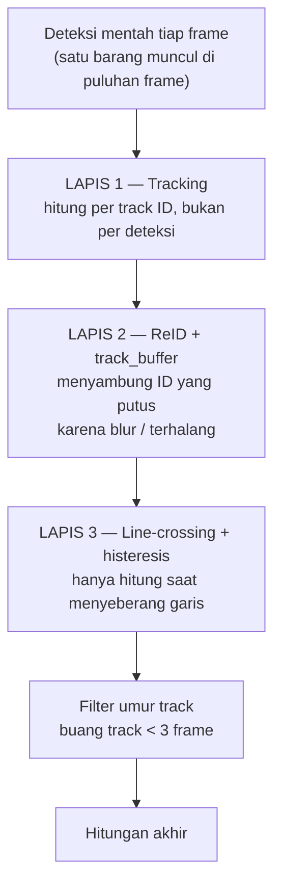
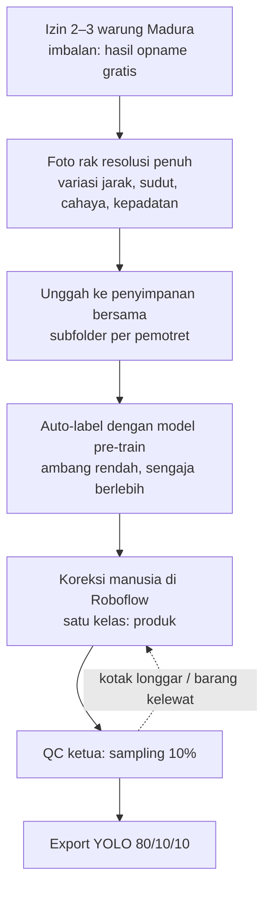
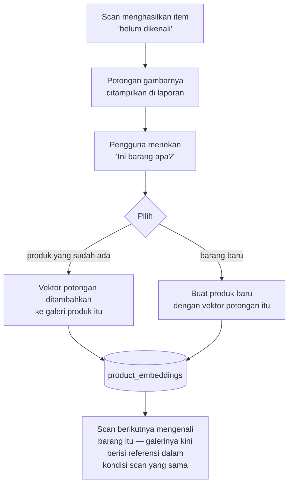
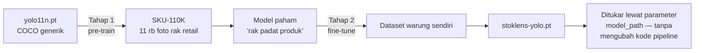
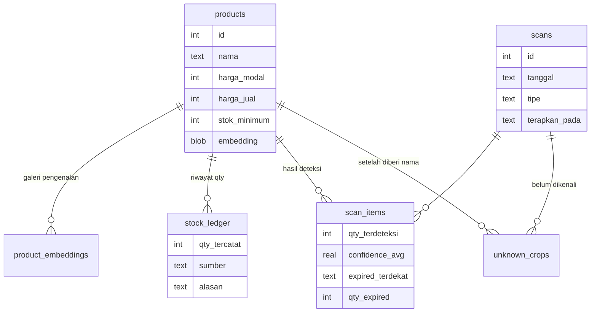

# DRAFT PROPOSAL — StokLens

> **STATUS: DRAFT LOKAL, BELUM DI-COMMIT.**
>
> Diagram memakai sintaks Mermaid — ter-render otomatis di GitHub, VS Code
> (ekstensi Markdown Preview Mermaid), Obsidian, dan https://mermaid.live
> (tempel kode di dalam blok ```mermaid, unduh sebagai PNG/SVG untuk ditempel
> ke Word/Docs).
>
> **Sebelum dikirim, wajib dibereskan:**
> - Semua penanda `⟨…⟩` diisi (nama tim, nama anggota, angka uji lapangan).
> - Bagian bertanda 🔴 masih menunggu data lapangan — jangan dikarang.
> - **Hapus semua jejak institusi** (nama kampus, email kampus, logo, template).
> - Batas **20 halaman** di luar cover, daftar pustaka, dan lampiran.
> - Cek plagiarisme sebelum submit.

---

## 1. Nama Tim dan Judul Proyek

**Nama tim:** ⟨nama tim⟩

**Judul:** StokLens — Stock Opname Otomatis Berbasis Visi Komputer untuk Warung
dan Toko Kelontong

**Anggota:** ⟨nama 1⟩ · ⟨nama 2⟩ · ⟨nama 3⟩ ⟨…⟩

**Tema:** Smart Logistics

---

## 2. Latar Belakang

### 2.1 Masalah

Warung Madura dan toko kelontong kecil menyimpan ratusan SKU dalam ruang sempit,
tetapi hampir tidak pernah melakukan stock opname. Alasannya bukan kemalasan,
melainkan biaya: menghitung manual satu warung memakan waktu berjam-jam dan
harus dilakukan saat toko tutup. Akibatnya pemilik tidak pernah tahu tiga angka
yang menentukan kelangsungan usahanya:

1. **Berapa nilai rupiah barang yang ada di rak sekarang.**
2. **Berapa banyak barang yang hilang** tanpa tercatat sebagai penjualan
   (*shrinkage*) — rusak, kedaluwarsa, salah hitung, atau hilang.
3. **Barang mana yang mendekati kedaluwarsa** sebelum berubah jadi kerugian.

Solusi yang ada di pasar tidak menjawab kondisi ini. Aplikasi stock opname
berbasis barcode mensyaratkan setiap barang punya barcode yang terbaca dan
di-scan satu per satu — untuk warung dengan sachet renceng dan barang curah,
syarat itu tidak terpenuhi. Sistem RFID mensyaratkan pemasangan tag per item,
biaya yang tidak masuk akal untuk barang seharga Rp 500.

### 2.2 Posisi terhadap solusi sejenis

Sudah ada pemain yang menggarap arah serupa — antara lain WarungVision dan fitur
"Smart AI Stock Opname" pada beberapa perangkat lunak kasir. **Kami tidak
mengklaim sebagai yang pertama.** Yang membedakan StokLens ada lima, dan
semuanya dapat ditunjukkan, bukan sekadar dinyatakan:

| Pembeda | Penjelasan |
|---|---|
| **Enrollment few-shot, nol retraining di lapangan** | Barang baru didaftarkan dengan 3–5 foto. Tidak ada proses training yang harus dijalankan pemilik warung. |
| **Menghitung *facing* di rak** | Sistem menghitung barang yang benar-benar terlihat di rak, bukan membaca angka dari dokumen laporan lewat OCR. |
| **Anti dobel-hitung berlapis** | Tiga mekanisme independen; dirinci di §4.3. |
| **Memperbaiki diri sendiri dari pemakaian** | Barang yang gagal dikenali dapat diberi nama oleh pengguna, dan potongan gambarnya langsung memperkaya galeri pengenalan. |
| **Berjalan lokal, tanpa API pihak ketiga** | Seluruh inferensi berjalan di perangkat sendiri. Biaya per-scan nol, dan foto dagangan tidak pernah keluar dari toko. Pembeda paling tajam terhadap solusi yang bergantung pada layanan AI berbayar. |

Poin terakhir bukan sekadar keunggulan teknis. Bagi pemilik warung, model bisnis
berbasis biaya per-panggilan-API berarti biaya yang tumbuh seiring pemakaian —
justru menghukum pengguna yang paling rajin melakukan opname.

---

## 3. Tujuan dan Manfaat

### 3.1 Tujuan

1. Pemilik warung dapat menyelesaikan opname satu rak **dalam hitungan menit**
   menggunakan kamera ponsel yang sudah dimilikinya, tanpa perangkat tambahan.
2. Hasilnya berupa **laporan selisih dalam rupiah**, bukan sekadar daftar angka
   deteksi — sehingga langsung dapat ditindaklanjuti.
3. Sistem **dapat dijalankan sepenuhnya offline** di satu laptop atau ponsel,
   tanpa langganan dan tanpa mengirim data ke pihak ketiga.

### 3.2 Manfaat

**Bagi pemilik usaha:** mengetahui nilai stok dan angka kehilangan yang selama
ini tidak terukur; peringatan dini barang mendekati kedaluwarsa; dasar
pengambilan keputusan pembelian ulang.

**Bagi ekosistem UMKM:** menurunkan ambang masuk pencatatan stok yang selama ini
hanya terjangkau ritel modern.

**Aspek etika dan privasi:** SOP pengambilan foto secara eksplisit melarang
memotret orang — hanya rak barang. Seluruh data tersimpan lokal.

---

## 4. Metodologi

### 4.1 Arsitektur sistem

Aturan arsitektur yang dipegang sejak awal: **logika murni dipisah dari
pembungkus model berat.** Seluruh pustaka berat (`torch`, `ultralytics`,
`easyocr`) hanya diimpor di dalam fungsi atau di satu modul pembungkus, tidak
pernah di tingkat modul yang memuat logika.

Konsekuensinya dapat diuji, bukan diklaim: **seluruh test cepat berjalan tanpa
`torch` terpasang**, dan pipeline CI membuktikannya pada setiap pull request
karena lingkungan CI memang sengaja tidak memasang tumpukan torch.



**Keputusan: SQLite satu berkas, bukan basis data terpisah.** Target pengguna
adalah warung dengan ratusan SKU, bukan ribuan cabang. SQLite menghilangkan
kebutuhan menjalankan layanan basis data, membuat seluruh aplikasi dapat
dijalankan dengan satu perintah `docker compose up`, dan membuat cadangan data
sesederhana menyalin satu berkas.

### 4.2 Alur inti: enroll → scan → laporan selisih



Panah putus-putus adalah kunci akurasi jangka panjang dan dirinci di §4.5.

### 4.3 Alur pengembangan tiap fitur

#### 4.3.1 Enrollment — pengenalan tanpa retraining



**Keputusan: CLIP zero-shot, bukan melatih pengklasifikasi.** Melatih
pengklasifikasi berarti setiap warung harus melatih ulang model setiap kali
menambah barang — mustahil dijalankan pemilik warung. Dengan pembandingan
embedding, menambah barang cukup menambah satu baris di basis data.

#### 4.3.2 Mode FOTO — jalur utama untuk warung



**Keputusan: mode foto jadi mode utama, bukan video.** Dalam satu foto, satu
deteksi = satu barang, sehingga seluruh kelas masalah "satu barang terhitung dua
kali karena ID tracking pecah" tidak pernah muncul. Mode foto juga jauh lebih
murah — enam foto sekitar 18 MB dibanding video sekitar 75 MB — dan OCR lebih
akurat karena foto diam lebih tajam daripada frame video yang blur karena
gerakan. Untuk warung yang sempit, mundur beberapa langkah untuk merekam sweep
sering kali tidak mungkin.

Risikonya berpindah ke antar-foto: zona tumpang tindih bisa terhitung dua kali.
Mitigasinya SOP satu foto satu sub-segmen berbatas fisik, ditambah **rincian
hitungan per foto** yang ditampilkan di antarmuka sehingga pengguna dapat
melihat dan mengoreksi sendiri.

#### 4.3.3 Mode VIDEO — untuk rak panjang



**Arah sweep tidak perlu dideklarasikan pengguna** — ditentukan otomatis dari
mayoritas arah penyeberangan seluruh track.

#### 4.3.4 Anti dobel-hitung — tiga lapis independen

Ini masalah paling menentukan pada mode video, dan diselesaikan berlapis karena
tidak ada satu mekanisme yang cukup:



Alasan tiap lapis, dan apa yang gagal ditangani lapis sebelumnya:

| Lapis | Menangani | Yang masih lolos |
|---|---|---|
| Tracking | Satu barang di banyak frame | ID pecah → barang sama dapat dua ID |
| ReID + buffer | ID pecah karena blur/terhalang sesaat | ID pecah yang terlalu jauh jaraknya |
| Line-crossing | ID pecah di sisi layar yang sama — hanya satu yang sempat menyeberang | Track sangat pendek dari noise |
| Filter umur | Noise berumur pendek | — |

Histeresis pada line-crossing menyerap goyangan kamera kecil di sekitar garis.
Penyeberangan balik menghasilkan event bernilai −1 yang saling menghapus dengan
+1 sebelumnya, sehingga hitungan **mengoreksi dirinya sendiri** ketika kamera
sempat mundur.

#### 4.3.5 OCR tanggal kedaluwarsa

Parser menangani format yang benar-benar dipakai kemasan Indonesia: `EXP`, `ED`,
`BB`, `BAIK SEBELUM`, `BEST BEFORE`, dengan pola tanggal-bulan-tahun,
nama-bulan-tahun (`AGU 26`, `DES 2026`), maupun bulan-tahun. Nama bulan Indonesia
dan Inggris dipetakan bersamaan karena keduanya lazim ditemukan pada kemasan yang
sama.

### 4.4 Alur perolehan dataset



**Keputusan: satu kelas `produk` saja, bukan satu kelas per merek.** Detektor
hanya perlu menjawab "di mana ada barang"; pengenalan merek dikerjakan CLIP.
Pemisahan ini membuat pekerjaan pelabelan jauh lebih cepat **dan** membuat
penambahan barang baru tidak memerlukan pelabelan ulang apa pun.

**Keputusan: menolak scraping marketplace.** Selain melanggar ketentuan layanan
dan hak cipta, jenis datanya salah — foto katalog berlatar putih, bukan adegan
rak. Model yang dilatih dengan data seperti itu justru belajar bias yang tidak
pernah ada di gudang.

**Keputusan: foto diambil di warung Madura, bukan grosir.** Model dasar sudah
dilatih pada rak supermarket; jika data sendiri juga diambil di lingkungan rapi
seperti grosir, satu jurang domain ditutup sementara jurang kedua dibuka. Ciri
warung yang tidak ada pada dataset supermarket: **sachet renceng yang
digantung**, cahaya bohlam hangat, rak improvisasi, dan ruang sempit.

**Keputusan pelabelan renceng: satu sachet = satu kotak.** Alasannya bukan teknis
melainkan bisnis — warung menjual dan menghitung stoknya per sachet. Jika model
menghitung per renceng, angka selisih pada laporan tidak akan cocok dengan cara
pemilik warung menghitung, dan seluruh fitur kehilangan maknanya baginya.

### 4.5 Perbaikan akurasi lewat pemakaian

Analisis kegagalan pencocokan menunjukkan penyebab utamanya **bukan** kemiripan
antar produk, melainkan **ketidakcocokan kondisi**: foto enrollment diambil
dekat, terang, dan tegak lurus, sementara potongan hasil scan berukuran kecil,
agak blur, dan menyerong. Urutan faktor perusak, dari yang paling parah:

1. Perbedaan skala dan ketajaman
2. Perbedaan cahaya dan suhu warna
3. Perbedaan sudut
4. Latar belakang rak
5. Foto stok dari internet — paling buruk, karena desain kemasannya sering
   sudah versi lama

Solusinya menghilangkan ketidakcocokan itu di akarnya:



**Keputusan: galeri banyak-vektor, BUKAN merata-ratakan.** Ini keputusan yang
sempat diambil salah lalu dikoreksi. Rencana awal adalah merata-ratakan vektor
enrollment dengan vektor potongan scan. Analisis menunjukkan hasilnya justru
buruk: merata-ratakan foto tampak-depan yang rapi dengan potongan menyerong yang
blur menghasilkan vektor yang **tidak mirip keduanya**. Yang akhirnya dibangun
adalah galeri berisi entri terpisah, dan pencocokan mengambil **similarity
tertinggi** di antara seluruh entri milik produk tersebut.

**Keputusan: vektor dihitung saat scan, bukan saat pengguna memberi nama.**
Konsekuensinya endpoint pemberian nama tidak perlu memuat CLIP sama sekali —
responsnya cepat dan dapat diuji tanpa torch. Biayanya sekitar 2 KB per potongan.

### 4.6 Alur integrasi model ke lingkungan kode

Model diperlakukan sebagai **dependensi yang dapat ditukar**, bukan bagian dari
kode. Bobot model tidak pernah masuk ke repositori — dibagikan lewat penyimpanan
bersama tim, dan repositori memblokirnya lewat `.gitignore`.



**Keputusan: pre-train dua tahap, bukan langsung fine-tune dari COCO.** Dataset
sendiri terlalu kecil untuk mengajarkan bentuk umum "rak penuh produk yang
rapat". SKU-110K mengajarkan itu; dataset sendiri mengajarkan kondisi lokal.

**Hasil Tahap 1 yang sudah dicapai** (RTX 4070, 20 epoch, 37 menit):

| Epoch | mAP50 | mAP50-95 |
|---|---|---|
| 1 | 0,756 | 0,408 |
| 11 | 0,850 | 0,505 |
| **20 (final)** | **0,868** | **0,525** |

Validasi akhir pada 588 gambar berisi 90.968 objek: presisi 0,894, recall 0,816,
waktu inferensi 1,7 ms per gambar. Kurva sudah melandai — dari epoch 11 ke 20
hanya naik 0,018 — sehingga 20 epoch dinilai sebagai titik henti yang tepat,
bukan angka yang dipilih sembarangan.

🔴 **Tahap 2 menunggu dataset lapangan.** Tabel berikut diisi setelah fine-tune:

| Pengukuran | Sebelum (pre-train) | Sesudah (fine-tune) |
|---|---|---|
| mAP50 pada test set warung | ⟨…⟩ | ⟨…⟩ |
| mAP50 pada warung yang tidak ikut training | ⟨…⟩ | ⟨…⟩ |

### 4.7 Skema data



**Keputusan: stok disimpan sebagai buku besar (ledger), bukan satu kolom
angka.** Angka selisih tidak bermakna tanpa angka pembanding yang tercatat
beserta asal-usulnya. Ledger membuat setiap perubahan stok dapat ditelusuri —
berasal dari opname yang mana, atau penyesuaian manual dengan alasan apa.

Penerapan hasil opname ke ledger berjalan dalam **satu transaksi atomik** dengan
penjagaan *compare-and-set*, sehingga dua permintaan bersamaan tidak dapat
menerapkan opname yang sama dua kali.

---

## 5. Metode Pendukung Pengambilan Keputusan

Bagian ini merangkum bagaimana keputusan diambil, bukan sekadar apa yang
diputuskan.

### 5.1 Keputusan yang diubah setelah analisis

| Keputusan awal | Diubah menjadi | Dasar perubahan |
|---|---|---|
| Rata-ratakan vektor enrollment dengan vektor scan | Galeri banyak-vektor, ambil similarity tertinggi | Analisis: rata-rata dua kondisi yang sangat berbeda menghasilkan vektor yang tidak mirip keduanya |
| Hitung per track ID | Tambah line-crossing sebagai lapis ketiga | Uji: ID pecah membuat satu barang terhitung dua kali |
| Video sebagai mode utama | Foto sebagai mode utama | Analisis biaya dan kelas kesalahan: satu foto = satu deteksi per barang, tidak ada masalah ID pecah |
| Ambil foto dataset di toko grosir | Ambil di warung Madura | Analisis domain: model dasar sudah dilatih pada rak rapi; mengambil data di lingkungan rapi membuka jurang domain kedua |
| Bangun export dan analitik tambahan | Dibatalkan | Ruang lingkup MVP harus tetap pada alur inti |

### 5.2 Kegagalan yang terdokumentasi

Dokumentasi tim menyimpan **alasan penolakan**, bukan hanya keputusan yang
diterima. Dua contoh yang berdampak nyata:

**Konflik semantik antar cabang.** Dua cabang yang masing-masing lulus pengujian
dapat menghasilkan kegagalan setelah digabung, karena konfliknya bersifat makna,
bukan tekstual — git melaporkan penggabungan bersih, tetapi pengujian gabungan
gagal. Terjadi dua kali sebelum akhirnya dijadikan aturan tertulis: **cabang yang
menyentuh berkas sama wajib menggabungkan cabang utama dan menjalankan pengujian
sebelum digabung.** Aturan turunannya: uji penjaga harus menguji **pola**, bukan
keberadaan kata.

**Regresi yang lahir dari perbaikan.** Pada satu unit, perbaikan atas kondisi
balapan justru menimbulkan cacat baru berupa tombol yang tidak pernah aktif
kembali. Ditemukan pada putaran review ketiga. Ini menjadi alasan mengapa
peninjauan dilakukan berlapis dan hasilnya ditulis ke dokumen rencana, bukan
dibiarkan hilang di percakapan.

### 5.3 Parameter yang dapat disetel, dan cara menyetelnya

| Parameter | Nilai awal | Gejala bila terlalu rendah | Gejala bila terlalu tinggi |
|---|---|---|---|
| Ambang pencocokan | 0,75 | Salah label antar varian mirip | Banyak item "belum dikenali" |
| Umur minimum track | 3 frame | Noise ikut terhitung | Barang yang sekilas terlihat terlewat |
| Interval pengambilan embedding | tiap 5 frame | Lambat | Suara terlalu sedikit untuk memilih label |

🔴 Nilai akhir ditetapkan berdasarkan uji lapangan; angka hasil penyetelan diisi
setelah pengujian.

### 5.4 Cara memverifikasi klaim

Klaim modularitas diverifikasi mesin, bukan pernyataan: pipeline CI memasang
lingkungan **tanpa** tumpukan torch dan menjalankan seluruh test cepat pada
setiap pull request. Pipeline terpisah **membangun image kontainer dan menguji
aplikasinya benar-benar melayani permintaan**, sehingga klaim "dapat dijalankan
dengan satu perintah" tidak bergantung pada laptop siapa pun.

---

## 6. Kesiapan dan Cara Menjalankan

Seluruh aplikasi berjalan lokal dengan satu perintah:

```bash
docker compose up --build
```

🔴 **Hasil uji lapangan** — diisi setelah pengujian di warung:

| Pengukuran | Hasil |
|---|---|
| Jumlah barang yang didaftarkan | ⟨…⟩ |
| Akurasi hitungan dibanding hitung manual | ⟨…⟩ |
| Waktu opname satu rak | ⟨…⟩ |
| Tanggapan pemilik warung | ⟨…⟩ |

---

## 7. Kesimpulan

StokLens menjawab persoalan yang nyata dan terukur: pemilik warung tidak
mengetahui nilai stok dan angka kehilangannya karena menghitung manual terlalu
mahal. Pendekatan yang dipilih — deteksi produk pada foto rak, pengenalan
berbasis pembandingan embedding tanpa retraining, dan pelaporan selisih dalam
rupiah — memungkinkan opname dilakukan dengan perangkat yang sudah dimiliki
pemilik warung.

Tiga hal yang kami anggap paling menentukan:

1. **Berjalan lokal sepenuhnya.** Biaya per-scan nol dan data tidak pernah keluar
   dari toko — pembeda terhadap solusi yang bergantung pada layanan AI berbayar.
2. **Memperbaiki diri dari pemakaian.** Setiap barang yang gagal dikenali lalu
   diberi nama pengguna memperkaya galeri dalam kondisi yang identik dengan
   kondisi pemakaian nyata.
3. **Keputusan berbasis analisis, termasuk yang dikoreksi.** Beberapa keputusan
   penting justru merupakan pembatalan rencana awal setelah analisis menunjukkan
   rencana itu keliru.

🔴 Angka uji lapangan dan hasil fine-tune tahap kedua akan melengkapi proposal
ini sebelum pengumpulan.

---

## Lampiran A — Ringkasan Keputusan Teknis

| # | Keputusan | Alasan singkat |
|---|---|---|
| 1 | SQLite satu berkas | Skala warung; satu perintah jalan; cadangan = salin berkas |
| 2 | CLIP zero-shot, bukan pengklasifikasi terlatih | Barang baru tidak boleh memerlukan retraining |
| 3 | Satu kelas `produk` pada detektor | Pelabelan cepat; barang baru tidak perlu pelabelan ulang |
| 4 | Mode foto sebagai mode utama | Satu deteksi = satu barang; lebih murah; OCR lebih tajam |
| 5 | Anti dobel-hitung berlapis tiga | Tidak ada satu mekanisme yang cukup |
| 6 | Galeri banyak-vektor, bukan rata-rata | Rata-rata dua kondisi berbeda tidak mirip keduanya |
| 7 | Vektor dihitung saat scan | Endpoint pemberian nama bebas CLIP, cepat, dapat diuji |
| 8 | Ledger, bukan kolom angka | Selisih tidak bermakna tanpa pembanding yang tertelusur |
| 9 | Pre-train dua tahap | Dataset sendiri terlalu kecil untuk bentuk umum rak |
| 10 | Foto dataset dari warung, bukan grosir | Menghindari jurang domain kedua |
| 11 | Satu sachet = satu kotak pada renceng | Menyamakan dengan cara warung menghitung stok |
| 12 | Menolak scraping marketplace | Melanggar ketentuan layanan dan jenis datanya salah |
