# DRAFT PROPOSAL: StokLens

> **STATUS: DRAFT UNTUK DITINJAU. Belum siap dikirim.**
>
> **Yang masih harus dibereskan sebelum submit:**
>
> - Isi angka uji lapangan di §6 dan §7 (bertanda 🔴). Jangan dikarang.
> - Periksa ulang tidak ada jejak institusi: nama kampus, email kampus, logo,
>   template. Termasuk nama folder yang terlihat di tangkapan layar.
> - Batas **20 halaman** di luar cover, daftar pustaka, dan lampiran.
>   Versi ini 18 halaman badan, plus daftar pustaka dan lampiran yang tidak
>   dihitung.
> - Cek plagiarisme.

---

## 1. Nama Tim dan Judul Proyek

**Nama tim:** The Goyzalis 2.0

**Judul:** StokLens, Stock Opname Otomatis Berbasis Visi Komputer untuk Warung
dan Toko Kelontong

**Anggota:** Marshal Rizky Raditya · Danish Ahmad Satria · Nicolas Nathan
Abimanyu · Muhammad Bhre Zidane Pribadi · Muhammad Noby Ghazali

**Tema:** Smart Logistics

---

## 2. Latar Belakang

### 2.1 Masalah

Toko kelontong tradisional adalah bentuk ritel paling banyak di Indonesia:
**3,94 juta unit, setara 98,78% dari seluruh ritel** [1]. Jumlah itu sedang
menyusut. Menurut APKLI, yang tersisa hingga akhir 2025 sekitar **3,9 juta unit,
turun dari 6,1 juta pada 2007** [2]. Lebih dari dua juta warung tutup dalam
delapan belas tahun, sebagian besar kalah bersaing dengan ritel modern.

Salah satu yang membedakan ritel modern bukan modalnya, melainkan bahwa mereka
**tahu angka stoknya**. Ritel modern mengukur kehilangan yang tidak tercatat
sebagai penjualan, dan di Amerika Serikat angkanya rata-rata **1,6% dari
penjualan**, atau 112,1 miliar dolar setahun [3]. Angka itu diketahui justru
karena mereka menghitung. Warung tidak punya angka bandingannya sama sekali,
bukan karena kehilangannya lebih kecil, melainkan karena tidak ada yang
menghitungnya.

Alasannya bukan kemalasan, melainkan biaya: menghitung ratusan SKU secara manual
memakan waktu berjam-jam dan harus dilakukan saat toko tutup. Sejalan dengan itu,
**77% UMKM Indonesia masih mencatat keuangan secara manual** [4]. Akibatnya
pemilik tidak pernah tahu dua angka yang menentukan kelangsungan usahanya:

1. **Berapa nilai rupiah barang yang ada di rak sekarang.**
2. **Berapa banyak barang yang hilang** tanpa tercatat sebagai penjualan
   (*shrinkage*): rusak, kedaluwarsa, salah hitung, atau hilang.

Keduanya adalah yang dijawab StokLens. Pembacaan tanggal kedaluwarsa per barang
sempat masuk rencana, diuji, lalu dikeluarkan dari lingkup setelah pengukuran
menunjukkan tidak dapat dikerjakan dari foto rak. Uraiannya ada di §4.3.5.

Solusi yang ada di pasar tidak menjawab kondisi ini. Aplikasi stock opname
berbasis barcode mensyaratkan setiap barang punya barcode yang terbaca dan
di-scan satu per satu. Untuk warung dengan sachet renceng dan barang curah,
syarat itu tidak terpenuhi. Sistem RFID mensyaratkan pemasangan tag per item,
biaya yang tidak masuk akal untuk barang seharga Rp 500.

### 2.2 Posisi terhadap solusi sejenis

Sudah ada pemain yang menggarap arah serupa, antara lain WarungVision dan fitur
"Smart AI Stock Opname" pada beberapa perangkat lunak kasir. **Kami tidak
mengklaim sebagai yang pertama.** Yang membedakan StokLens ada lima, dan
semuanya dapat ditunjukkan, bukan sekadar dinyatakan:

| Pembeda | Penjelasan |
|---|---|
| **Enrollment few-shot, nol retraining di lapangan** | Barang baru didaftarkan dengan 3–5 foto. Tidak ada proses training yang harus dijalankan pemilik warung. |
| **Menghitung *facing* di rak** | Sistem menghitung barang yang benar-benar terlihat di rak, bukan membaca angka dari dokumen laporan lewat OCR. |
| **Anti dobel-hitung berlapis** | Pada mode video: tiga mekanisme independen (§4.3.4). Pada mode foto, yang menjadi mode utama, satu deteksi = satu barang sehingga masalahnya tidak muncul di dalam satu foto; risiko antar-foto ditekan lewat SOP dan rincian hitungan per foto yang dapat diperiksa pengguna. |
| **Memperbaiki diri sendiri dari pemakaian** | Barang yang gagal dikenali dapat diberi nama oleh pengguna, dan potongan gambarnya langsung memperkaya galeri pengenalan. |
| **Berjalan lokal, tanpa API pihak ketiga** | Seluruh inferensi berjalan di perangkat sendiri. Biaya per-scan nol, dan foto dagangan tidak pernah keluar dari toko. Pembeda paling tajam terhadap solusi yang bergantung pada layanan AI berbayar. |

Poin terakhir bukan sekadar keunggulan teknis. Bagi pemilik warung, model bisnis
berbasis biaya per-panggilan-API berarti biaya yang tumbuh seiring pemakaian, dan itu
justru menghukum pengguna yang paling rajin melakukan opname.

---

## 3. Tujuan dan Manfaat

### 3.1 Tujuan

1. Pemilik warung dapat menyelesaikan opname satu rak **dalam hitungan menit**
   menggunakan kamera ponsel yang sudah dimilikinya, tanpa perangkat tambahan.
2. Hasilnya berupa **laporan selisih dalam rupiah**, bukan sekadar daftar angka
   deteksi, sehingga langsung dapat ditindaklanjuti.
3. Sistem **dapat dijalankan sepenuhnya offline** pada satu komputer di toko,
   diakses dari ponsel lewat jaringan setempat, tanpa langganan dan tanpa
   mengirim data ke pihak ketiga. Inferensi berjalan di komputer itu; ponsel
   berperan sebagai kamera dan antarmuka. Menjalankan model langsung di ponsel
   berada di luar lingkup penyisihan.

### 3.2 Manfaat

**Bagi pemilik usaha:** mengetahui nilai stok dan angka kehilangan yang selama
ini tidak terukur, serta memiliki dasar angka untuk keputusan pembelian ulang.

**Bagi ekosistem UMKM:** menurunkan ambang masuk pencatatan stok yang selama ini
hanya terjangkau ritel modern.

**Aspek etika dan privasi:** SOP pengambilan foto secara eksplisit melarang
memotret orang, hanya rak barang. Seluruh data tersimpan lokal.

---

## 4. Metodologi

### 4.1 Arsitektur sistem

Aturan arsitektur yang dipegang sejak awal: **logika murni dipisah dari
pembungkus model berat.** Seluruh pustaka berat (`torch`, `ultralytics`,
`open_clip`) hanya diimpor di dalam fungsi atau di satu modul pembungkus, tidak
pernah di tingkat modul yang memuat logika.

Konsekuensinya dapat diuji, bukan diklaim: **seluruh test cepat berjalan tanpa
`torch` terpasang**, dan pipeline CI membuktikannya pada setiap pull request
karena lingkungan CI memang sengaja tidak memasang tumpukan torch.

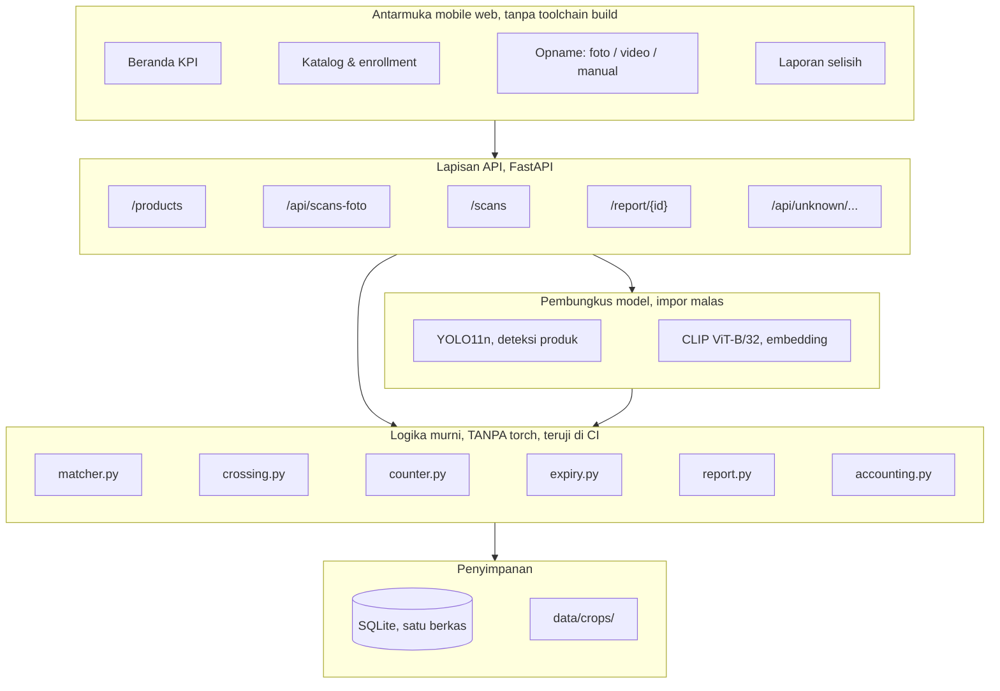

**Keputusan: SQLite satu berkas, bukan basis data terpisah.** Target pengguna
adalah warung dengan ratusan SKU, bukan ribuan cabang. SQLite menghilangkan
kebutuhan menjalankan layanan basis data, membuat seluruh aplikasi dapat
dijalankan dengan satu perintah `docker compose up`, dan membuat cadangan data
sesederhana menyalin satu berkas.

### 4.2 Alur inti: enroll → scan → laporan selisih

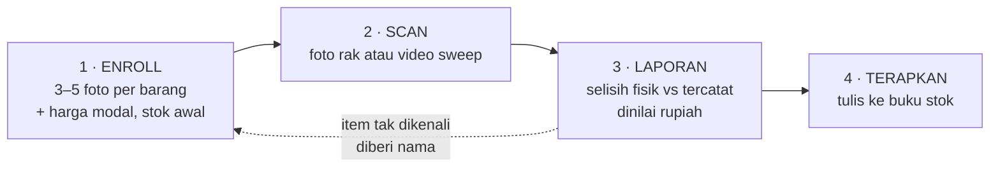

Panah putus-putus adalah kunci akurasi jangka panjang dan dirinci di §4.5.

### 4.3 Alur pengembangan tiap fitur

#### 4.3.1 Enrollment: pengenalan tanpa retraining

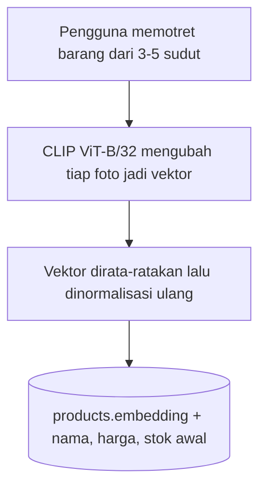

**Keputusan: CLIP zero-shot, bukan melatih pengklasifikasi.** Melatih
pengklasifikasi berarti setiap warung harus melatih ulang model setiap kali
menambah barang, dan itu mustahil dijalankan pemilik warung. Dengan pembandingan
embedding, menambah barang cukup menambah satu baris di basis data.

#### 4.3.2 Mode FOTO: jalur utama untuk warung

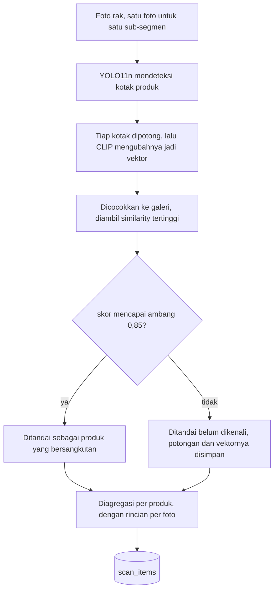

**Keputusan: mode foto jadi mode utama, bukan video.** Dalam satu foto, satu
deteksi = satu barang, sehingga seluruh kelas masalah "satu barang terhitung dua
kali karena ID tracking pecah" tidak pernah muncul. Mode foto juga jauh lebih
murah (enam foto sekitar 18 MB dibanding video sekitar 75 MB), dan foto diam
tidak membawa blur gerakan seperti frame video, sehingga potongan yang masuk ke
pencocokan lebih tajam. Untuk warung yang sempit, mundur beberapa langkah untuk
merekam sweep sering kali tidak mungkin.

Risikonya berpindah ke antar-foto: zona tumpang tindih bisa terhitung dua kali.
Mitigasinya SOP satu foto satu sub-segmen berbatas fisik, ditambah **rincian
hitungan per foto** yang ditampilkan di antarmuka sehingga pengguna dapat
melihat dan mengoreksi sendiri.

#### 4.3.3 Mode VIDEO untuk rak panjang

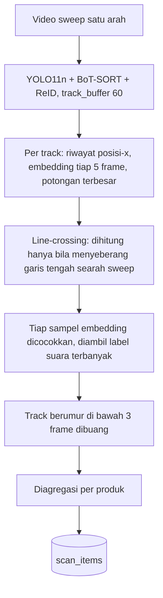

**Arah sweep tidak perlu dideklarasikan pengguna**, ditentukan otomatis dari
mayoritas arah penyeberangan seluruh track.

#### 4.3.4 Anti dobel-hitung: tiga lapis independen

Ini masalah paling menentukan pada mode video, dan diselesaikan berlapis karena
tidak ada satu mekanisme yang cukup:

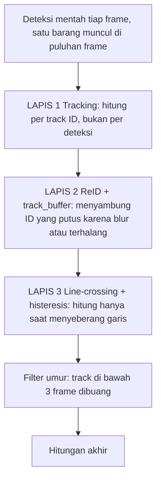

Alasan tiap lapis, dan apa yang gagal ditangani lapis sebelumnya:

| Lapis | Menangani | Yang masih lolos |
|---|---|---|
| Tracking | Satu barang di banyak frame | ID pecah → barang sama dapat dua ID |
| ReID + buffer | ID pecah karena blur/terhalang sesaat | ID pecah yang terlalu jauh jaraknya |
| Line-crossing | ID pecah di sisi layar yang sama, hanya satu yang sempat menyeberang | Track sangat pendek dari noise |
| Filter umur | Noise berumur pendek | tidak ada |

Histeresis pada line-crossing menyerap goyangan kamera kecil di sekitar garis.
Penyeberangan balik menghasilkan event bernilai −1 yang saling menghapus dengan
+1 sebelumnya, sehingga hitungan **mengoreksi dirinya sendiri** ketika kamera
sempat mundur.

#### 4.3.5 Pembacaan tanggal kedaluwarsa: diuji, lalu dikeluarkan dari lingkup

Parser tanggal untuk format kemasan Indonesia (`EXP`, `ED`, `BAIK SEBELUM`,
nama bulan Indonesia dan Inggris) selesai dan lulus 11 pengujian. **Yang tidak
pernah divalidasi adalah pasangannya**: apakah OCR sanggup menghasilkan teks
tanggal itu dari potongan foto rak. Kami mengukurnya:

| Kondisi | Potongan diuji | Menghasilkan teks | **Tanggal kedaluwarsa terbaca** |
|---|---|---|---|
| Resolusi penuh | 64 | 43 | **0** |
| Setelah pengecilan ke 1280 px | 53 | 33 | **0** |

OCR-nya sendiri bekerja: 43 dari 64 potongan menghasilkan teks berupa nama
merek dan tulisan besar kemasan. Yang tidak pernah muncul justru tanggalnya.

Sebabnya struktural, bukan ketajaman gambar. Tanggal kedaluwarsa dicetak inkjet
atau laser tipis berkontras rendah di belakang, di bawah, atau pada lipatan
sambungan, sedangkan sisi yang menghadap rak justru sisi yang tidak membawanya.
Informasi itu tidak ada di dalam frame, sehingga menaikkan resolusi tidak
menolong.

**Keputusan: dikeluarkan dari lingkup MVP** dan tidak didemonstrasikan.
Menyertakannya berarti menjanjikan sesuatu yang, menurut pengukuran kami
sendiri, tidak akan berjalan di tangan pemilik warung. Jalan yang masuk akal
bila diteruskan kelak adalah foto close-up terpisah, bukan mengharapkan satu
foto rak melayani dua jarak pengambilan sekaligus.

### 4.4 Alur perolehan dataset

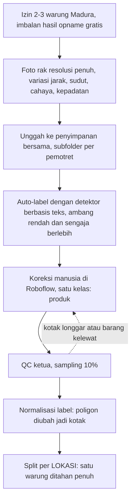

**Split per lokasi, bukan split acak.** Split acak bawaan menaruh foto yang
nyaris kembar, 3–5 jepretan rak yang sama dalam hitungan detik, di data latih
*dan* data uji sekaligus. Angkanya terlihat jauh lebih baik dan tidak berarti
apa-apa.

**Satu kelas `produk` saja, bukan satu kelas per merek.** Detektor hanya perlu
menjawab "di mana ada barang"; pengenalan merek dikerjakan CLIP. Pelabelan jadi
jauh lebih cepat, dan barang baru tidak memerlukan pelabelan ulang apa pun.

**Menolak scraping marketplace.** Selain melanggar ketentuan layanan dan hak
cipta, jenis datanya salah: foto katalog berlatar putih, bukan adegan rak.

**Foto diambil di warung Madura, bukan grosir.** Model dasar sudah dilatih pada
rak supermarket; mengambil data di grosir yang sama rapinya menutup satu jurang
domain sambil membuka jurang kedua. Ciri warung yang tidak ada di dataset
supermarket: sachet renceng yang digantung, cahaya bohlam hangat, rak
improvisasi, ruang sempit.

**Satu sachet = satu kotak, bukan satu renceng.** Alasannya bisnis, bukan
teknis: warung menjual dan menghitung per sachet. Kalau model menghitung per
renceng, angka selisihnya tidak cocok dengan cara pemilik warung menghitung, dan
laporannya kehilangan makna baginya.

### 4.5 Perbaikan akurasi lewat pemakaian

Analisis kegagalan pencocokan menunjukkan penyebab utamanya **bukan** kemiripan
antar produk, melainkan **ketidakcocokan kondisi**: foto enrollment diambil
dekat, terang, dan tegak lurus, sementara potongan hasil scan berukuran kecil,
agak blur, dan menyerong. Urutan faktor perusak, dari yang paling parah:

1. Perbedaan skala dan ketajaman
2. Perbedaan cahaya dan suhu warna
3. Perbedaan sudut
4. Latar belakang rak
5. Foto stok dari internet, paling buruk, karena desain kemasannya sering
   sudah versi lama

Solusinya menghilangkan ketidakcocokan itu di akarnya:

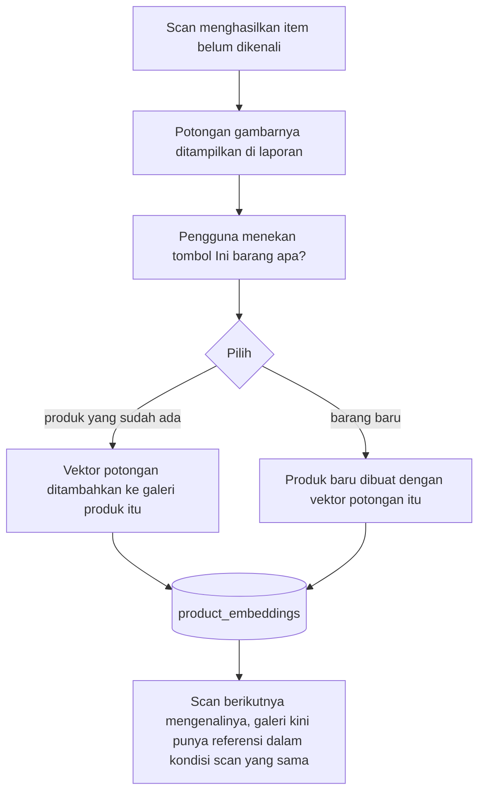

**Keputusan: galeri banyak-vektor, BUKAN merata-ratakan.** Ini keputusan yang
sempat diambil salah lalu dikoreksi. Rencana awal adalah merata-ratakan vektor
enrollment dengan vektor potongan scan. Analisis menunjukkan hasilnya justru
buruk: merata-ratakan foto tampak-depan yang rapi dengan potongan menyerong yang
blur menghasilkan vektor yang **tidak mirip keduanya**. Yang akhirnya dibangun
adalah galeri berisi entri terpisah, dan pencocokan mengambil **similarity
tertinggi** di antara seluruh entri milik produk tersebut.

**Keputusan: vektor dihitung saat scan, bukan saat pengguna memberi nama.**
Konsekuensinya endpoint pemberian nama tidak perlu memuat CLIP sama sekali,
responsnya cepat dan dapat diuji tanpa torch. Biayanya sekitar 2 KB per potongan.

### 4.6 Alur integrasi model ke lingkungan kode

Model diperlakukan sebagai **dependensi yang dapat ditukar**, bukan bagian dari
kode. Bobot model tidak pernah masuk ke repositori, melainkan dibagikan lewat penyimpanan
bersama tim, dan repositori memblokirnya lewat `.gitignore`.

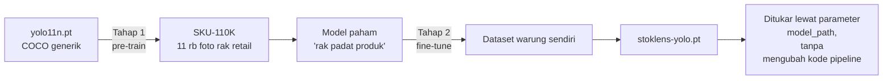

**Keputusan: pre-train dua tahap, bukan langsung fine-tune dari COCO.** Dataset
sendiri terlalu kecil untuk mengajarkan bentuk umum "rak penuh produk yang
rapat". SKU-110K mengajarkan itu; dataset sendiri mengajarkan kondisi lokal.

**Hasil Tahap 1 yang sudah dicapai** (RTX 4070, 20 epoch, 37 menit):

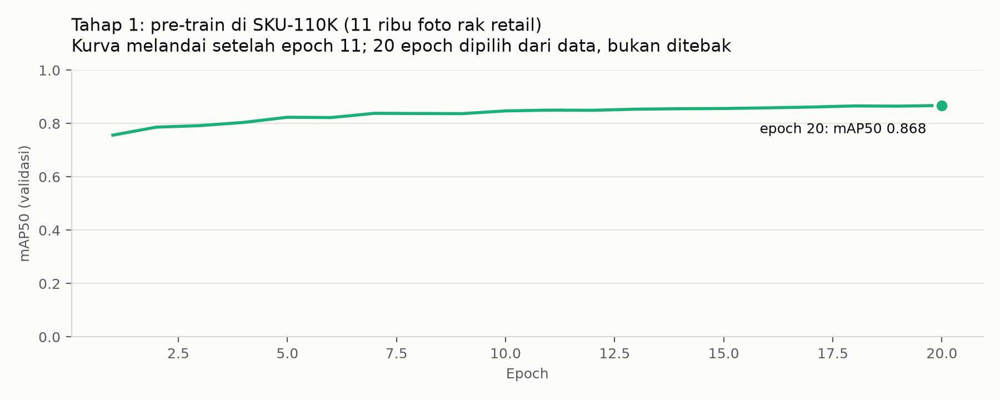

| Epoch | mAP50 | mAP50-95 |
|---|---|---|
| 1 | 0,756 | 0,408 |
| 11 | 0,850 | 0,505 |
| **20 (final)** | **0,868** | **0,525** |

Validasi akhir pada 588 gambar berisi 90.968 objek: presisi 0,894, recall 0,816,
waktu inferensi 1,7 ms per gambar. Kurva sudah melandai: dari epoch 11 ke 20
hanya naik 0,018 sehingga 20 epoch dinilai sebagai titik henti yang tepat,
bukan angka yang dipilih sembarangan.

**Hasil Tahap 2 (22 Agustus 2026).** Fine-tune dijalankan pada dataset warung
sendiri, 60 epoch, 30 menit di RTX 4070.

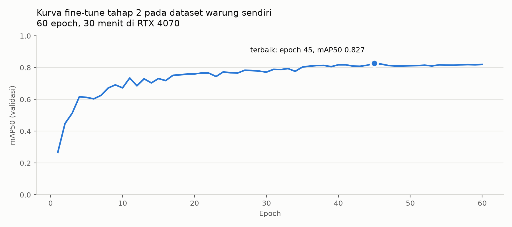

#### Cara pengujian, dan kenapa caranya begitu

Angka di bawah ini diukur pada **85 foto dari satu warung yang seluruhnya
ditahan dari data latih**. Model tidak pernah melihat satu pun foto dari lokasi
itu. Pilihan ini disengaja dan penting.

Split acak bawaan Roboflow akan memberi angka yang jauh lebih tinggi, tetapi
tidak sah: SOP pemotretan kami mengambil 3–5 foto per rak dalam hitungan detik,
sehingga foto yang nyaris kembar akan tersebar ke data latih *dan* data uji.
Model akan dinilai pada rak yang sudah pernah dilihatnya. Angka yang keluar
mengukur ingatan, bukan kemampuan menghadapi warung baru, dan warung baru
persis yang dihadapi produk ini setiap kali dipasang di toko berikutnya.

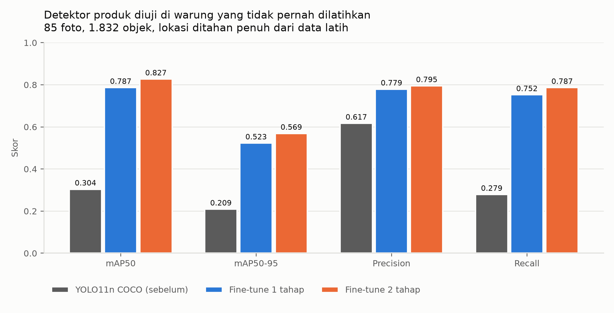

| Pengukuran | YOLO11n COCO (sebelum) | Fine-tune 1 tahap | **Fine-tune 2 tahap** |
|---|---|---|---|
| mAP50 | 0,304 | 0,787 | **0,827** |
| mAP50-95 | 0,209 | 0,523 | **0,569** |
| Precision | 0,617 | 0,779 | **0,795** |
| Recall | 0,279 | 0,752 | **0,787** |

Yang paling berarti untuk produk adalah **recall**: 0,279 → 0,787. Model generik
hanya menemukan 28% barang di rak; setelah fine-tune menjadi 79%. Barang yang
tidak terdeteksi tidak akan pernah terhitung, sehingga recall-lah yang membatasi
akurasi opname, bukan mAP.

**Tahap 1 terbukti menyumbang, bukan sekadar cerita kepatuhan.** Fine-tune yang
berangkat dari checkpoint SKU-110K mengungguli fine-tune langsung dari COCO
sebesar +0,040 mAP50 dan +0,034 recall, dengan dataset, jumlah epoch, dan
seluruh hyperparameter yang identik. Selisih itu satu-satunya yang berbeda:
titik awal bobot.

### 4.7 Skema data

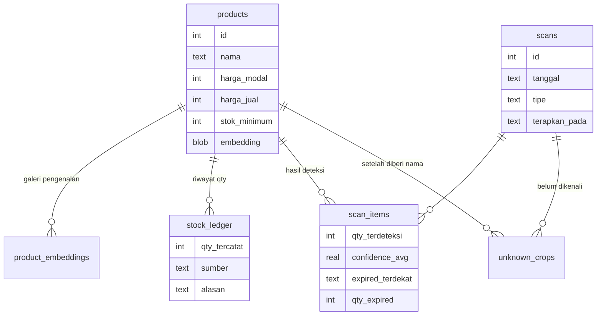

**Keputusan: stok disimpan sebagai buku besar (ledger), bukan satu kolom
angka.** Angka selisih tidak bermakna tanpa angka pembanding yang tercatat
beserta asal-usulnya. Ledger membuat setiap perubahan stok dapat ditelusuri:
berasal dari opname yang mana, atau penyesuaian manual dengan alasan apa.

Penerapan hasil opname ke ledger berjalan dalam **satu transaksi atomik** dengan
penjagaan *compare-and-set*, sehingga dua permintaan bersamaan tidak dapat
menerapkan opname yang sama dua kali.

---

## 5. Metode Pendukung Pengambilan Keputusan

Bagian ini merangkum bagaimana keputusan diambil, bukan sekadar apa yang
diputuskan.

### 5.1 Keputusan yang diubah setelah analisis

| Keputusan awal | Diubah menjadi | Dasar perubahan |
|---|---|---|
| Rata-ratakan vektor enrollment dengan vektor scan | Galeri banyak-vektor, ambil similarity tertinggi | Analisis: rata-rata dua kondisi yang sangat berbeda menghasilkan vektor yang tidak mirip keduanya |
| Hitung per track ID | Tambah line-crossing sebagai lapis ketiga | Uji: ID pecah membuat satu barang terhitung dua kali |
| Video sebagai mode utama | Foto sebagai mode utama | Analisis biaya dan kelas kesalahan: satu foto = satu deteksi per barang, tidak ada masalah ID pecah |
| Ambil foto dataset di toko grosir | Ambil di warung Madura | Analisis domain: model dasar sudah dilatih pada rak rapi; mengambil data di lingkungan rapi membuka jurang domain kedua |
| Bangun export dan analitik tambahan | Dibatalkan | Ruang lingkup MVP harus tetap pada alur inti |

### 5.2 Kegagalan yang terdokumentasi

Dokumentasi tim menyimpan **alasan penolakan**, bukan hanya keputusan yang
diterima. Tiga yang berdampak nyata:

**Konflik semantik antar cabang.** Dua cabang yang masing-masing lulus pengujian
bisa gagal setelah digabung, karena konfliknya bersifat makna: git melaporkan
penggabungan bersih, pengujian gabungan tetap gagal. Terjadi dua kali, lalu jadi
aturan tertulis: cabang yang menyentuh berkas sama wajib menggabungkan cabang
utama dan menjalankan pengujian sebelum digabung.

**Kerusakan label yang tidak menimbulkan satu pun pesan galat.** Pelabel kami
memakai *Smart Polygon* untuk barang berlekuk sambil tetap memakai kotak biasa
untuk dus, dan dokumentasi internal kami sendiri menyatakan pencampuran itu
tidak bermasalah. Ternyata bermasalah, di tempat yang tidak terlihat:

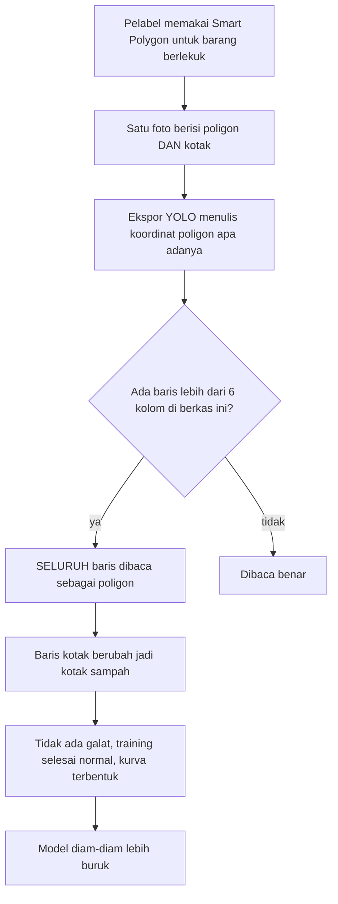

Terukur: dari **11.779 anotasi**, **2.339 kotak (19,9%) berada di 116 berkas
campuran** dan akan rusak. Berkas yang seragam justru aman; yang mematikan
adalah pencampuran di dalam satu foto. Temuan ini menghasilkan langkah
normalisasi wajib sebelum pelatihan dan koreksi pada panduan internal.

**Fitur yang dibatalkan setelah diukur.** Parser tanggal kedaluwarsa dibangun
dan lulus 11 pengujian. Yang tidak pernah diperiksa justru asumsi dasarnya:
bahwa tanggal itu terlihat pada foto rak. Ketika diukur, hasilnya **nol dari 64
potongan** (§4.3.5), dan fitur itu dikeluarkan dari lingkup.

Pola ketiganya sama, dan itulah alasan bagian ini ada: pekerjaan mengalir ke
bagian yang paling mudah dibangun dan diuji, sementara asumsi yang menopangnya
dibiarkan tak tersentuh. Kegagalan yang tidak memunculkan galat adalah yang
paling mahal, dan pertahanannya cuma satu, memeriksa sendiri, bukan menunggu
peringatan.

### 5.3 Parameter yang dapat disetel, dan cara menyetelnya

| Parameter | Nilai berlaku | Gejala bila terlalu rendah | Gejala bila terlalu tinggi |
|---|---|---|---|
| Ambang pencocokan | **0,85** (diukur) | Barang asing disangka produk terdaftar | Banyak item "belum dikenali" |
| Umur minimum track | 3 frame | Noise ikut terhitung | Barang yang sekilas terlihat terlewat |
| Interval pengambilan embedding | tiap 5 frame | Lambat | Suara terlalu sedikit untuk memilih label |

#### Ambang pencocokan: dari tebakan menjadi pengukuran

Nilai 0,75 yang dipakai di awal tidak pernah divalidasi: dasarnya hanya tiga
kasus tunggal, dan itu anekdot. Kami mengukurnya ulang pada **12 produk dan 104
foto** dengan dua uji terpisah: *leave-one-out* untuk kemampuan mengenali, dan
*leave-one-product-out* untuk kemampuan menolak.

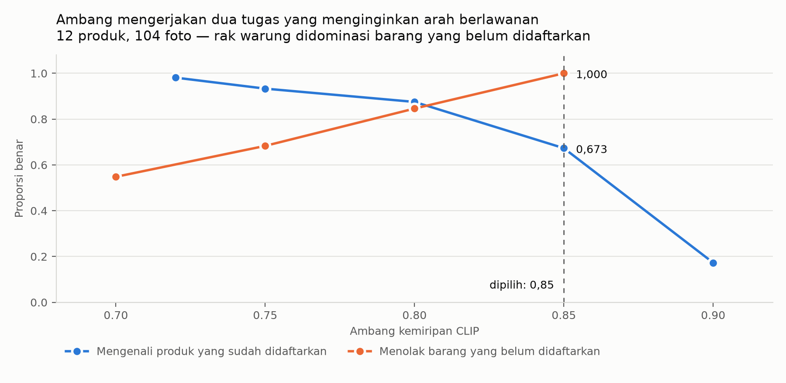

Pengukuran itu memperlihatkan hal yang tidak terlihat sebelumnya: **pada 0,75,
satu dari tiga barang yang belum didaftarkan disangka produk lain** 33 dari
104. Di laporan opname, kesalahan itu muncul sebagai barang dengan nama yang
salah. Ini jenis kesalahan paling merusak, karena hasilnya terbaca meyakinkan
dan tidak meninggalkan tanda apa pun bahwa ada yang keliru.

Ambang mana yang terbaik bergantung pada komposisi rak:

| Rasio barang asing : terdaftar | Ambang terbaik |
|---|---|
| 1 : 1 | 0,80 |
| **3 : 1 (rak warung nyata)** | **0,85** |

Warung mendaftarkan puluhan produk sementara raknya memuat ratusan barang,
sehingga barang yang belum terdaftar jauh lebih banyak. **Keputusan: naik ke
0,85.** Konsekuensinya diterima secara sadar: pengenalan produk terdaftar turun
dari 0,933 ke 0,673, ditukar dengan kesalahan penamaan yang turun dari 33 kasus
menjadi nol. Bagi pemilik warung, "belum dikenali" adalah barang yang tinggal
diberi nama sekali; "salah nama" adalah angka rupiah yang salah tanpa ia sadari.

### 5.4 Cara memverifikasi klaim

Klaim modularitas diverifikasi mesin, bukan pernyataan: pipeline CI memasang
lingkungan **tanpa** tumpukan torch dan menjalankan seluruh test cepat pada
setiap pull request. Pipeline terpisah **membangun image kontainer dan menguji
aplikasinya benar-benar melayani permintaan**, sehingga klaim "dapat dijalankan
dengan satu perintah" tidak bergantung pada laptop siapa pun.

---

## 6. Kesiapan dan Cara Menjalankan

Seluruh aplikasi berjalan lokal dengan satu perintah:

```bash
docker compose up --build
```

🔴 **Hasil uji lapangan**, diisi setelah pengujian di warung:

| Pengukuran | Hasil |
|---|---|
| Jumlah barang yang didaftarkan | ⟨…⟩ |
| Akurasi hitungan dibanding hitung manual | ⟨…⟩ |
| Waktu opname satu rak | ⟨…⟩ |
| Tanggapan pemilik warung | ⟨…⟩ |

---

## 7. Kesimpulan

StokLens menjawab persoalan yang nyata dan terukur: pemilik warung tidak
mengetahui nilai stok dan angka kehilangannya karena menghitung manual terlalu
mahal. Pendekatan yang dipilih (deteksi produk pada foto rak, pengenalan
berbasis pembandingan embedding tanpa retraining, dan pelaporan selisih dalam
rupiah) memungkinkan opname dilakukan dengan perangkat yang sudah dimiliki
pemilik warung.

Tiga hal yang kami anggap paling menentukan:

1. **Berjalan lokal sepenuhnya.** Biaya per-scan nol dan data tidak pernah keluar
   dari toko, pembeda terhadap solusi yang bergantung pada layanan AI berbayar.
2. **Memperbaiki diri dari pemakaian.** Setiap barang yang gagal dikenali lalu
   diberi nama pengguna memperkaya galeri dalam kondisi yang identik dengan
   kondisi pemakaian nyata.
3. **Keputusan berbasis analisis, termasuk yang dikoreksi.** Beberapa keputusan
   penting justru merupakan pembatalan rencana awal setelah analisis menunjukkan
   rencana itu keliru: ambang pencocokan yang dinaikkan setelah diukur, dan
   panduan pelabelan internal yang dikoreksi setelah ditemukan merusak 20%
   anotasi tanpa memunculkan galat.

Fine-tune dua tahap sudah selesai dan terukur pada warung yang seluruhnya
ditahan dari data latih: **mAP50 0,304 → 0,827** dan **recall 0,279 → 0,787**.
Recall adalah angka yang membatasi akurasi opname, karena barang yang tidak
terdeteksi tidak akan pernah terhitung.

🔴 Angka uji lapangan di warung melengkapi proposal ini sebelum pengumpulan.

---

## Daftar Pustaka

[1] Niaga.Asia, "Jumlah Toko Kelontong 3,94 Juta, Mendag: Setara 98,78 Persen
Ritel", 11 November 2024, mengutip data Euromonitor 2022.
https://www.niaga.asia/jumlah-toko-kelontong-394-juta-mendag-setara-9878-persen-ritel/

[2] Bisnis Daily, "Jumlah Warung Kelontong Terus Menyusut, APKLI: Tersisa 3,9
Juta Unit", 27 Februari 2026, mengutip Asosiasi Pedagang Kaki Lima Indonesia.
https://bisnisdaily.com/read/serba-serbi-umkm/jumlah-warung-kelontong-terus-menyusut-apkli-tersisa-39-juta-unit

[3] National Retail Federation, "National Retail Security Survey 2023",
26 September 2023. Rata-rata *shrink rate* FY2022 sebesar 1,6% dari penjualan,
setara 112,1 miliar dolar AS. https://nrf.com/research/national-retail-security-survey-2023

[4] OCBC dan NielsenIQ, "Business Fitness Index 2024", dilaporkan Suara.com,
26 November 2025. https://www.suara.com/bisnis/2025/11/26/074526/riset-77-persen-umkm-masih-lakukan-pencatatan-keuangan-secara-manual

Catatan: rujukan [3] berasal dari ritel modern Amerika Serikat dan **tidak**
dipakai sebagai estimasi kehilangan di warung Indonesia. Angka itu dikutip untuk
menunjukkan bahwa besaran seperti itu hanya diketahui bila ada yang menghitung,
dan warung tidak memilikinya.

---

## Lampiran A: Ringkasan Keputusan Teknis

| # | Keputusan | Alasan singkat |
|---|---|---|
| 1 | SQLite satu berkas | Skala warung; satu perintah jalan; cadangan = salin berkas |
| 2 | CLIP zero-shot, bukan pengklasifikasi terlatih | Barang baru tidak boleh memerlukan retraining |
| 3 | Satu kelas `produk` pada detektor | Pelabelan cepat; barang baru tidak perlu pelabelan ulang |
| 4 | Mode foto sebagai mode utama | Satu deteksi = satu barang; lebih murah; tanpa blur gerakan |
| 5 | Anti dobel-hitung berlapis tiga | Tidak ada satu mekanisme yang cukup |
| 6 | Galeri banyak-vektor, bukan rata-rata | Rata-rata dua kondisi berbeda tidak mirip keduanya |
| 7 | Vektor dihitung saat scan | Endpoint pemberian nama bebas CLIP, cepat, dapat diuji |
| 8 | Ledger, bukan kolom angka | Selisih tidak bermakna tanpa pembanding yang tertelusur |
| 9 | Pre-train dua tahap | Dataset sendiri terlalu kecil untuk bentuk umum rak |
| 10 | Foto dataset dari warung, bukan grosir | Menghindari jurang domain kedua |
| 11 | Satu sachet = satu kotak pada renceng | Menyamakan dengan cara warung menghitung stok |
| 12 | Menolak scraping marketplace | Melanggar ketentuan layanan dan jenis datanya salah |
